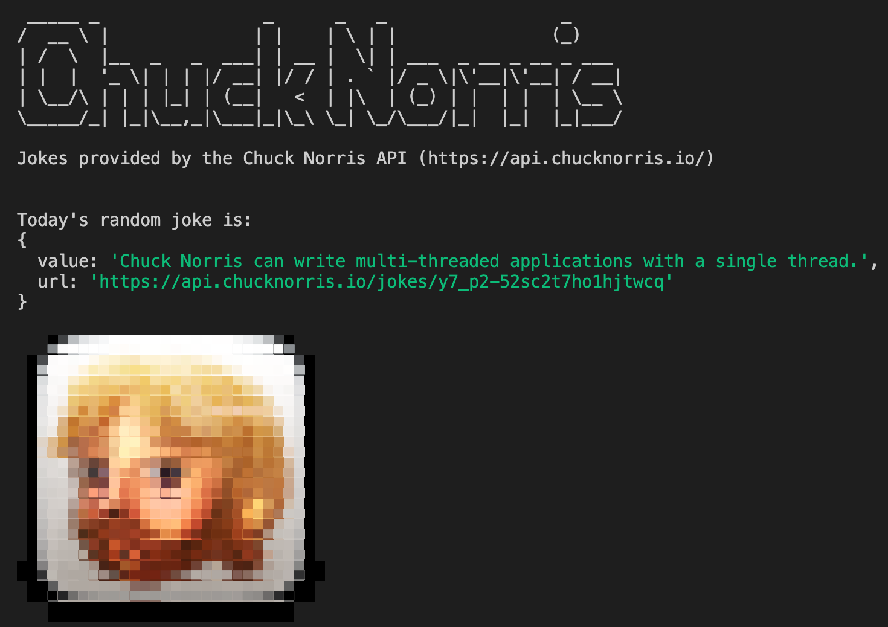

# chuck-norris-ts-cli
TypeScript example CLI using the Chuck Norris Api

Each run will retrieve a new random joke from The Chuck Norris Api - https://api.chucknorris.io/ and display it.

## Installation / Local Dev
- `npm i`
- `npm run build` | `npm run build-watch`
- `npm start`

---

## Screenshot:

---

## Credits:
Special thanks to the [Chuck Norris Api](https://api.chucknorris.io/) for providing the random chuck norris jokes!
